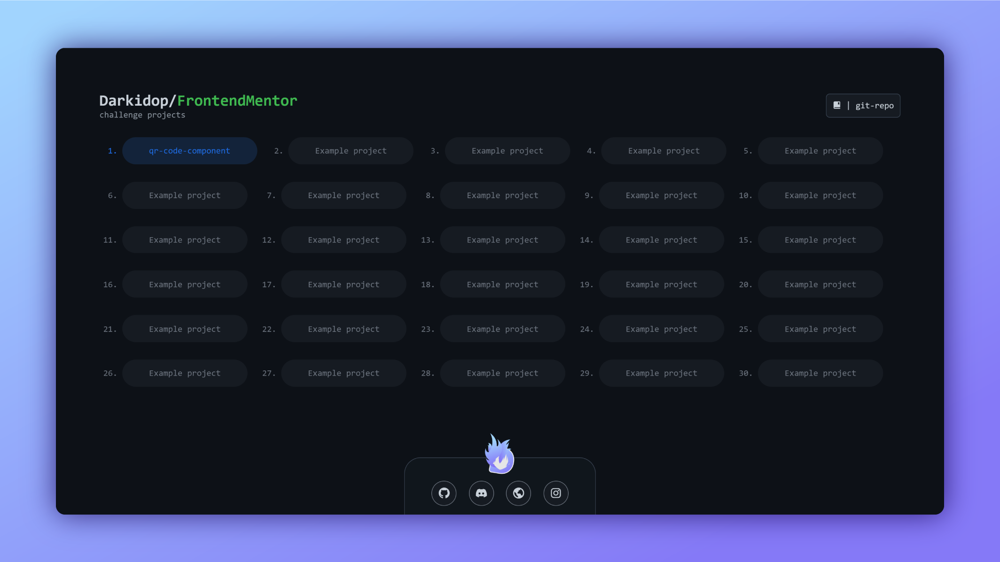

# This repo is for my completed frontend mentor challenges.

<!-- ## Table of contents
- [This is repo for my completed frontend mentor challenges.](#this-is-repo-for-my-completed-frontend-mentor-challenges)
  - [Table of contents](#table-of-contents)
  - [Overview](#overview)
    - [Screenshot](#screenshot)
    - [Links](#links)
  - [My process](#my-process)
    - [Built with](#built-with)
    - [What I learned](#what-i-learned)
    - [Continued development](#continued-development)
  - [Author](#author) -->

## Overview

### Main page preview

### Links
- Live Site URL: [darkidop.github.io/FrontendMentor](https://darkidop.github.io/FrontendMentor)

### Built with
- Semantic HTML5 markup
- CSS custom properties
- CSS Grid
- Flexbox
- [Boxicons](https://boxicons.com/)

## Author

- Website - [darkid.otakulink.net](https://darkid.otakulink.net)
- Frontend Mentor - [@DarkidOP](https://www.frontendmentor.io/profile/DarkidOP)
- Discord - [! Darkid#1060](https://discord.com/users/522340125380706314)
- Github - [@darkidop](https://github.com/Darkidop)
- Instagram - [@darkidop](https://instagram.com/darkidop)
